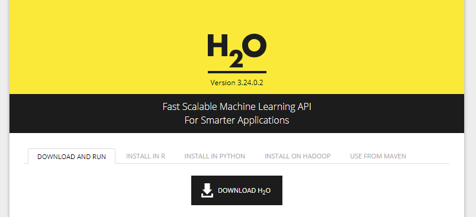
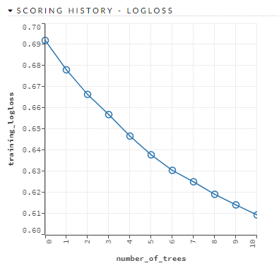
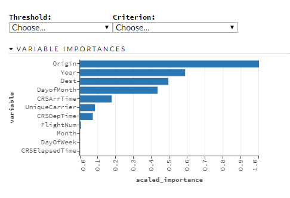

---
authors:
- admin
date: "2019-04-25"
draft: false
image:
  caption: ''
  focal_point: "left"
  preview_only: false
subtitle: 'A web-based interactive notebook-like computational environment.'
summary: A new user's experience with H2O Flow
tags: []
title: 'My experience with using H2O Flow'
---

## Background
I came across H<sub>2</sub>O several times in the past couple of years but I didn't get a chance to try it out by myself. Until very recently, I went to the [SatRday Los Angeles conference 2019](https://losangeles2019.satrdays.org/) at UCLA this year where Erin LeDell ([@ledell](https://twitter.com/ledell)) gave a keynote talk on [scalable automatic machine learning with H2O](https://youtu.be/A3EmOgpoG60). The elegant way she has navigated the model building process has fascinated me. Most importantly, H<sub>2</sub>O also has a very nice and friendly interface called H<sub>2</sub>O flow to users to quickly familiarize themselves with this tool. Here is a more detailed and official [documentation](http://docs.h2o.ai/h2o/latest-stable/h2o-docs/flow.html) of how to use H<sub>2</sub>O flow. But I'd like to highlight my favorite features. 

## Let's get started

1. First, go to the H<sub>2</sub>O website to [download the zip file](http://h2o-release.s3.amazonaws.com/h2o/rel-yates/2/index.html). 

    

2. Follow the instruction to unzip the file and run it from your terminal. 

    ```
    cd Downloads
    unzip h2o-3.24.0.2.zip
    cd h2o-3.24.0.2
    java -jar h2o.jar
    ```
    
3. Then type http://localhost:54321 in your browser. 

    

## Feature highlight

1. Notebook layout
    
    The feature that I appreciate the most is the similar layout as the Jupyter notebook. By adopting the style of the existing tools, it saves the users time from learning using the new interface to really starting to adopt this new tool. 

2. Examples 

    Without too much efforts, new users can directly jump into the pipeline by opening the existing projects, i.e., deep learning, GBM, XGbBoost and etc.  
    
    Control Panel  | Examples
    :-------------:|:-------------------:
     |  

3. Running time 

    Another noticable feature of the flow is that users have a better sense of time cost of each component in the pipeline. The running time of each block is shown by default, which also improves the users engagement from using this new tool. 
    
    
    
3. Model diagnostics tools

    After the models are implemented and performed, the H<sub>2</sub>O flow generates a wide range of output for users to select from. Here are some examples from a project using GBM for airline classificaiton.
    
     Scoring history | ROC curve | Variable importances
    :-------------:|:---------------:|:-------------------:
     |   |  
    
If you would like to know more, here is an article on Medium about democratising machine learning with H<sub>2</sub>O, which also introduces all the available H<sub>2</sub>O products including the driverless ai. You can also find a list of publications using H<sub>2</sub>O [here](https://www.h2o.ai/academic/). 
