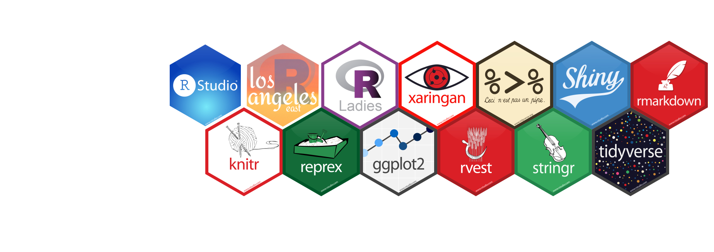

---
authors:
- admin
date: "2019-01-29"
draft: false
gallery_item:
image:
  caption: ''
  focal_point: "smart"
  preview_only: false
lastmod: "2019-04-03T00:00:00-08:00"
subtitle: 'Create a beautifully and professional header'
summary: Learn how to make a header with R hex-stickers for LinkedIn and Twitter.
projects:
- viz
tags:
- R
- RStudio
title: 'Learn how to make a header with R hex-stickers for LinkedIn and Twitter'
---

## Background

Nowadays, peoples use LinkedIn and Twitter to look for opportunities and network with others. Except for gaining more skills and doing projects to boost your profile, there is another way to make your profile more professional: finding the right header. No one will argue with the fact that the header picture helps with creating the first impression for recruiters and your future employers. To begin with creating a profile, it might take forever for you to pick their favorite picture as the header but still keep professional. Here is how to create your own unique header showing your professional skills! If you are an R user, here might be a good idea to create your own header with all your favorite R hex-stickers that is perfect and ready for LinkedIn and Twitter.

Last year, I came across this post, [USER!2018 Feature Wall](https://blog.mitchelloharawild.com/blog/user-2018-feature-wall/),  by Mitchell O'Hara-Wild. I was amazed about the design and aesthetics of this map. In the post, he described his experience of creating a feature wall for the useR!2018 and he wrote a package to do it as well. Today, we will use his codes to make our own header. 


## Let's get started

1. First, go to the GitHub repository [mitchelloharawild/hexwall](https://github.com/mitchelloharawild/hexwall) and follow his instructions to set everything up. 


2. Creat your own list of R stickers. Mitchell has recommended downloading from the RStudio hex-stickers from their GitHub repository ([rstudio/hex-stickers](https://github.com/rstudio/hex-stickers)). Mitchell has provided a folder with some sample stickers. Add more your favorite stickers into that folder. 

3. If you prefer some stickers at a particular position, i.e., RStudio hex sticker comes as the first one. Then, you should rename those files to make sure they appear in the right order. Here is a quick peek into my stickers list folder. 

    

4. By run the following two lines of code, you will get a perfect and professional R stickers wall header for your LinkedIn and Twitter profile. 

    ```
    source('hexwall.R')
    hexwall("samplelist", sticker_row_size = 7, sticker_width = 200)
    ```



